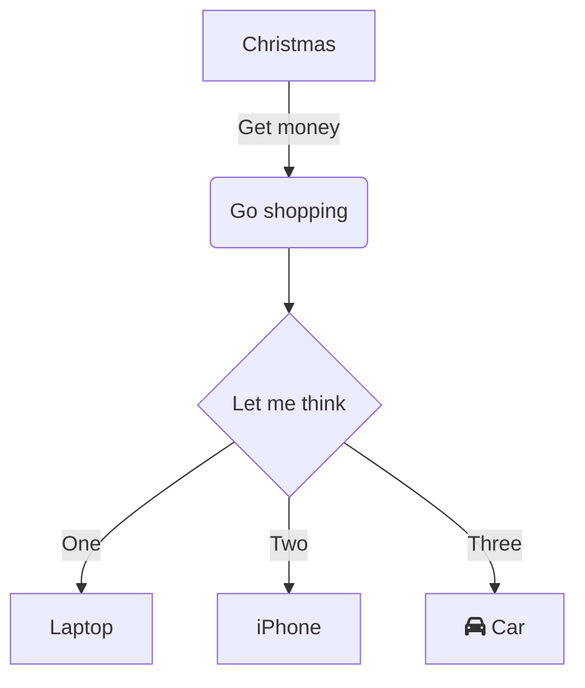

https://docs.microsoft.com/en-us/learn/modules/manage-git-branches-workflows/2-explore-branch-workflow-types

git branching strategy
https://docs.microsoft.com/en-us/azure/devops/repos/git/git-branching-guidance?view=azure-devops


https://support.typora.io/Draw-Diagrams-With-Markdown/


https://git-scm.com/book/en/v2/Getting-Started-About-Version-Control


- how does the git workflow scale with team getting bigger
- is it easy to undo mistakes
- added effort to the team
- give branches meaningful names. Branch - try new ideas
- master branch = project history
- write meaningful commit messages
- PR - start discussion about commits. work doesn't have to be finished, getting stuck, ready for review.

2 main strategies:

Feature Branch Workflow:
- all feature development is in dedicated branch and not main one. main branch never contain broken code. 
- group of developers can work on few features
- discuss about branch - use pull requests
- - pull request - tell others that you modified code in a branch. PR can be from branch or commit. PR initializes review page which compares 2 branches. if you don't have write rights to master, fork the repository first. when creating PR, you can specify into which branch changes will be done. PR can be linked  

<div class="center">


</div>

Forking workflow
- each developer has their private repository
- central public repository


# PR
@mention in PR message
- written in markdown
- provides unified view for collaboration work on a feature

## PR vs MR
- PR asking someone for review (pull to master)
- MR asking to merge changes to master


# what is squashing, rebasing
## squashing - combine multiple commits into 1. no standalone git squash command 
https://www.git-tower.com/learn/git/faq/git-squash
## rebasing
to integrate changes from one branch to another, there are 2 options - merge and rebase

# CD part
add features to solution

"You'll learn always to use the combination of feature branches and pull requests to have a ready-to-ship main branch."

https://docs.microsoft.com/en-us/learn/modules/manage-git-branches-workflows/4-explore-git-branch-model-for-continuous-delivery


# feature flags
- toggle features on off
- app needs do be configured to use it 


# git commands
```
git log --pretty=format:"%h %s" --graph

https://git-scm.com/docs/git-status
git status -s 
git status -s test456
git status -b -s
git status -v

# restoring files

https://www.git-tower.com/learn/git/faq/restoring-deleted-files
https://www.atlassian.com/git/tutorials/saving-changes/git-diff


# restore deleted file before commit
git checkout HEAD git_notes.md

# restore deleted file after commit


# git diff
changed but not yet staged
