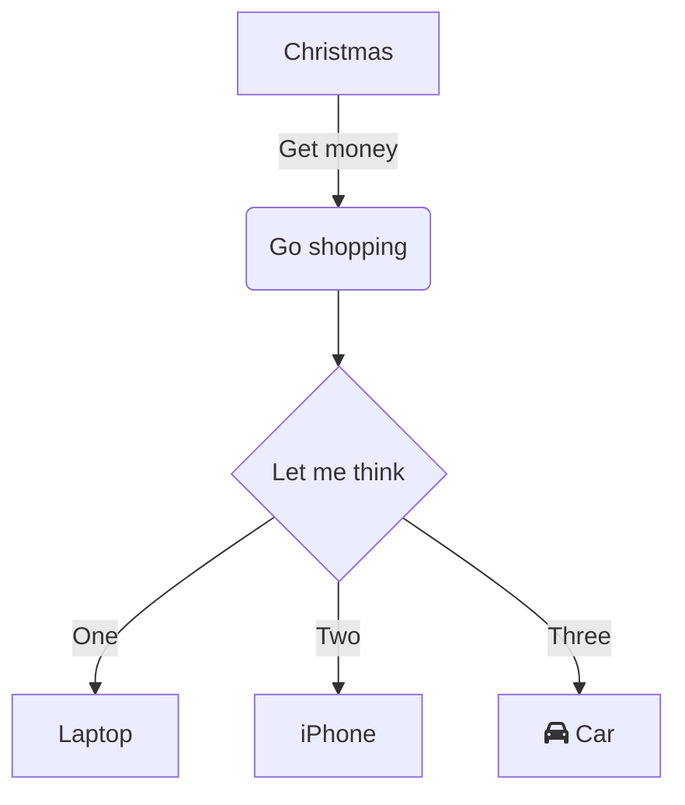

https://docs.microsoft.com/en-us/learn/modules/manage-git-branches-workflows/2-explore-branch-workflow-types

https://support.typora.io/Draw-Diagrams-With-Markdown/

- how does the git workflow scale with team getting bigger
- is it easy to undo mistakes
- added effort to the team

2 main strategies:

Feature Branch Workflow:
- all feature development is in dedicated branch and not main one. main branch never contain broken code. 
- group of developers can work on few features
- discuss about branch - use pull requests
- - pull request - tell others that you modified code in a branch. PR can be from branch or commit. PR initializes review page which compares 2 branches. if you don't have write rights to master, fork the repository first. when creating PR, you can specify into which branch changes will be done. PR can be linked  

Forking workflow
- each developer has their repository
